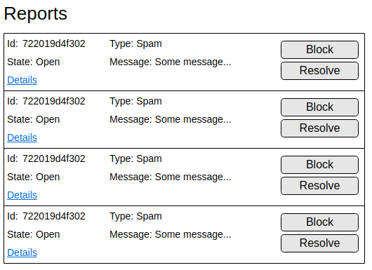

Hubrick Fullstack Challenge
========================

We're excited that you're interested in joining the [Hubrick](https://www.hubrick.com/) team.
The purpose of this test is to see how you approach problems as well as to evaluate the quality of your code.

# Challenge description
The challenge is to create a small full stack application that consists of a server and a web based UI in order to manage reported content.
The UI should look something like

We provide an example listing response ([data/reports.json](data/reports.json)) that you can use as the basis of your listing. Please fill the
appropriate fields in the wireframe, ignore the "Details" link. 

Furthermore we need a way to block the content and resolve those reports. The two buttons in the frontend should do a call
to your backend service in order to block the content and to resolve the ticket. You are free to make up the blocking as
you want, the resolving is defined as a PUT request to an endpoint with this structure /reports/<report Id>. An example
request for how to update a report is in [data/update_ticket_request.json](data/update_ticket_request.json).

# Instructions
- Please don't spend more than 3 hours. We don't expect a production-ready solution.
- Choose whatever tech you are comfortable with and that lets you achieve a solution in the given time limit.
- Provide the solution source code either as zip or as a link to the code repository

# What we're looking for:
- Code quality
- Technical choices
- Something we can actually run 
